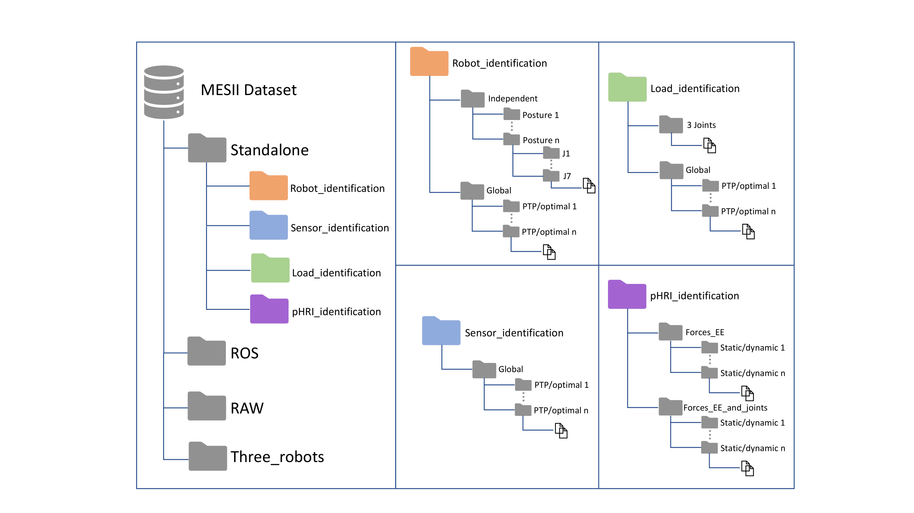
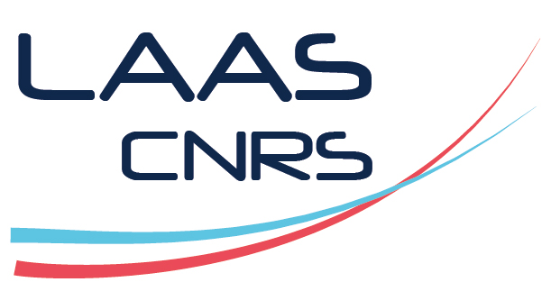

# MESII Dataset  
**Manipulator Experimental System Identification for Interaction**

## 📌 Introduction

Datasets have gained huge importance in recent years due to the rise of big-data and open science. They are mainly a way to give the research community and society in general the tools to both: 

- verify publications based on the dataset either because it may have experiments that are difficult, tedious, or impossible to replicate,
- give the possibility to fellow multidisciplinary researchers to continue the research work and deepen the knowledge on one topic from different points of views.

With this in mind, we present the **MESII Dataset** for collaborative robotics identification. It provides real measurements of positions and torques of a complex manipulator, allowing for:

- Testing of filters  
- Parameter identification techniques  
- Construction of observers

This dataset contains data from several **7-DOF KUKA iiwa 14 R820 manipulators** and is structured to support experiments in both classical and collaborative settings.

---

## 📂 Dataset Description

The dataset includes **four main folders**:
- `Standalone/`: Filtered data in `.log` files  
- `ROS/`: Filtered data in `.rosbag` format  
- `RAW/`: Raw, unprocessed data
- `Three Robots/`: Data to compare three different Kuka IIWA robots

Each of the three first folders include subfolders for:
- Robot identification
- Sensor identification
- Load identification
- pHRI (physical Human-Robot Interaction)

Scenarios include:
- Global and sequential joint movements
- End-effector interaction only (via F/T sensor)
- Full-body interaction (across the kinematic chain)
- Both **static** and **dynamic** interaction states

**Folder structure :**

---

## 📁 Files

You can download the dataset files below:

- [Standalone.zip](https://drive.google.com/file/d/16rURDDbI87eGEho6cLPIahVDpylBAW68/view?usp=drive_link)
- [ROS.zip](https://drive.google.com/file/d/1pJGMEZQzd4l5OYqfXGLXkDL7tNJCXnDq/view?usp=drive_link)
- [RAW.zip](https://drive.google.com/file/d/1HKuMESO4hMxjOz65eNp27G6fGqtgM0jE/view?usp=drive_link)
- [Three_Robots.zip](https://drive.google.com/file/d/1FsigXHgdyZNIk_Qj-D3LdXcfh0MfhfDl/view?usp=drive_link)
- [Data_details.txt](./Files/Data_details.txt)
- [Example_Video.mp4](https://drive.google.com/file/d/16-oA-X5OnCOgZPRk8VPLO2u1GTdRwRdx/view?usp=drive_link)

> **⚠️ Note:** New trajectories, videos and supporting files are under construction and coming soon.

---

## 📚 Citation

If you use the MESSII dataset in your research, please cite the corresponding publication (details to be added here soon).

---

## 👨‍🔬 Authors & Contact

If you have questions or suggestions, feel free to contact us:

**Dr. Fabio Ardiani**  
*State Estimation R&D Technical Lead*  
📧 fabio.ardiani@nio-robotics.com  
🏢 Nio Robotics - Toulouse

**Dr. Martin Mujica**  
*Associate Professor*  
📧 martin.mujica@laas.fr  
🏢 LAAS-CNRS – Toulouse

**Dr. Mourad Benoussaad**  
*Associate Professor*  
📧 mourad.benoussaad@enit.fr  
🏢 LGP, ENIT – Tarbes

**Dr. Jean-Yves Fourquet**  
🏢 LGP, ENIT – Tarbes

**Dr. Alexandre Janot**  
🏢 ONERA – Palaiseau

---

## 🏢 Institutions

---