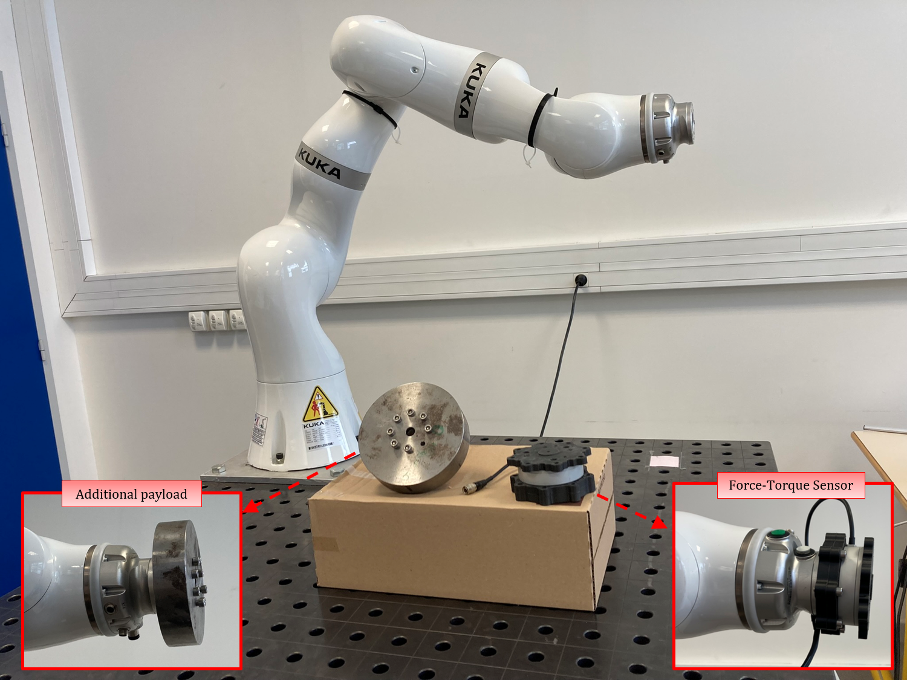

# MESSII Dataset  
**Manipulator Experimental SyStem Identification for Interaction**

## 📌 Introduction

Datasets have gained huge importance in recent years due to the rise of big-data and open science. They help:

- Validate experiments that are difficult or impossible to replicate.
- Enable researchers from various fields to build upon existing work.

With this in mind, we present the **MESSII Dataset** for collaborative robotics identification. It provides real measurements of positions and torques of a complex manipulator, allowing for:

- Testing of filters  
- Parameter identification techniques  
- Construction of observers

This dataset contains data from a **7-DOF KUKA iiwa 14 R820 manipulator** and is structured to support experiments in both classical and collaborative settings.

---

## 📂 Dataset Description

The dataset includes **three main folders**:
- `Standalone/`: Filtered data in `.log` files  
- `ROS/`: Filtered data in `.rosbag` format  
- `RAW/`: Raw, unprocessed data

Each folder includes subfolders for:
- Robot identification
- Sensor identification
- Load identification
- pHRI (physical Human-Robot Interaction)

Scenarios include:
- Global and sequential joint movements
- End-effector interaction only (via F/T sensor)
- Full-body interaction (across the kinematic chain)
- Both **static** and **dynamic** interaction states

**Folder structure examples:**

Standalone/ ├── robot_identification/ │ ├── global/ │ └── sequential/ ├── sensor_identification/ ├── load_identification/ └── pHRI_identification/

### 📸 Structure Diagrams

| Global Structure | Inner Structure |
|------------------|-----------------|
|  |  |

---

## 📁 Files

You can download the dataset files below:

- [Standalone.zip](https://drive.google.com/file/d/16rURDDbI87eGEho6cLPIahVDpylBAW68/view?usp=drive_link)
- [ROS.zip](https://drive.google.com/file/d/1pJGMEZQzd4l5OYqfXGLXkDL7tNJCXnDq/view?usp=drive_link)
- [RAW.zip](https://drive.google.com/file/d/1HKuMESO4hMxjOz65eNp27G6fGqtgM0jE/view?usp=drive_link)
- [Three_Robots.zip](https://drive.google.com/file/d/1FsigXHgdyZNIk_Qj-D3LdXcfh0MfhfDl/view?usp=drive_link)
- [Data_details.txt](./Files/Data_details.txt)
- [Example_Video.mp4](https://drive.google.com/file/d/16-oA-X5OnCOgZPRk8VPLO2u1GTdRwRdx/view?usp=drive_link)

> **⚠️ Note:** New trajectories, videos and supporting files are under construction and coming soon.

---

## 📚 Citation

If you use the MESSII dataset in your research, please cite the corresponding publication (details to be added here soon).

---

## 👨‍🔬 Authors & Contact

If you have questions or suggestions, feel free to contact us:

**Fabio Ardiani**  
*PhD Student (2020–2023)*  
📧 fabio.ardiani@enit.fr  
🏢 LGP, ENIT – Tarbes

**Dr. Martin Mujica**  
*Associate Professor*  
📧 martin.mujica@laas.fr  
🏢 LAAS-CNRS – Toulouse

**Dr. Mourad Benoussaad**  
*Associate Professor*  
📧 mourad.benoussaad@enit.fr  
🏢 LGP, ENIT – Tarbes

**Dr. Jean-Yves Fourquet**  
🏢 LGP, ENIT – Tarbes

**Dr. Alexandre Janot**  
🏢 ONERA – Toulouse

---

## 🏢 Institutions

|  |  |  |
|--------------------------|------------------------------|-----------------------------|
